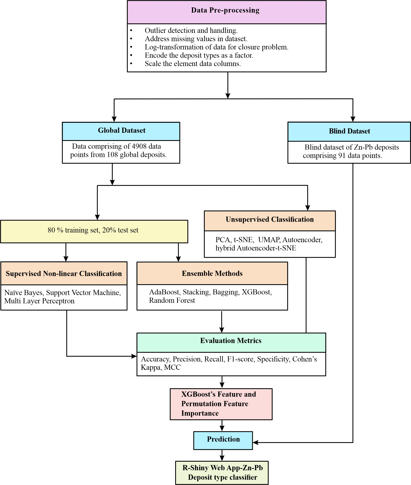

# Zn–Pb Deposit Classification

Categorization of Zn–Pb deposits based on sphalerite geochemistry using machine learning.

## Project Description

This project uses sphalerite trace element geochemistry to classify Zn–Pb deposit types using machine learning models such as Random Forest, XGBoost, SVM, AdaBoost and Stacking.

## Code Repository

[View GitHub Code](https://github.com/Arkodeepgeo)

## Web Application

[Open Web App](https://your-shiny-webapp-link)

## Workflow



© Sengupta et al. 2026

